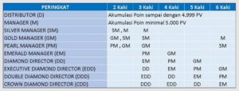
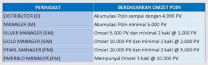

Informasi Jenjang karir bisnis Nasa tentunya menjadi pengetahuan yang sangat penting bagi setiap Distributor terutama anda yang fokus dan serius ingin mengembangkan bisnis produk Nasa sebagai salah satu profesi penting.

Untuk itulah kami sebagai Support System untuk Distributor jaringan Stockist G.1251 ingin membagikan info jenjang karir yang bisa anda capai di Bisnis Nasa. Namun sebelum sampai pada pembahasan ini, ada baiknya anda memahami istilah-istilah dalam Marketing Plan Nasa.

### 10 Peringkat Jenjang Karir Bisnis Nasa

Jenjang karir adalah suatu posisi atau peringkat seorang Distributor Nasa yang bisa dicapai berdasarkan prestasi omset ataupun pembinaan jaringan pemasaran didalam grupnya. Kalau pada pegawai negeri mungkin bisa disamakan dengan pangkat atau golongan. Peringkat ini merupakan salah satu faktor penentu perolehan beberapa macam bonus atau royalti penghasilan di Bisnis Nasa.

**1. Distributor**

Mempunyai akumulasi omset sampai dengan 4.999 PV, sejak pertama mendaftar Distributor NASA.

**2. Manager (M)**

Mempunyai akumulasi omset minimal 5.000 PV

**3. Silver Manager (SM)**

*Syarat pencapaiannya:*

* Melepas 2 kaki dengan satu kaki melepas Silver Manager dan satu kaki yang lain melepas Manager ATAU
* Melepas 3 kaki masing-masing kaki melepas peringkat manager ATAU
* Mempunyai omset 5.000 PV dan minimal mempunyai 2 kaki masing-masing mencapai omset 1.000 PV

**4. Gold Manager (GM)**

"Syarat pencapaiannya:*

* Melepas 2 kaki dengan satu kaki melepas Gold Manager dan satu kaki yang lain melepas Silver Manager ATAU
* Melepas 3 kaki masing-masing kaki melepas peringkat Silver Manager ATAU
* Melepas 6 kaki masing-masing melepas peringkat Manager ATAU
* Mempunyai Omset 10.000 PV dan minimal mempunyai 2 kaki masing-masing mencapai omset minimal 2.000 PV

**5. Pearl Manager (PM)**

*Syarat pencapaiannya:*

* Melepas 2 kaki dengan satu kaki melepasPearl Manager dan satu kaki yang lain melepas Gold Manager ATAU
* Melepas 3 kaki masing-masing kaki melepas peringkat Gold Manager ATAU
* Melepas 6 kaki masing-masing kaki melepas peringkat Silver Manager ATAU
* Mempunyai Omset 20.000 PV dan minimalmempunyai 2 kaki masing-masing mencapai omset minimal 5.000 PV

**6. Emerald Manager (EM)**

*Syarat pencapaiannya:*

* Melepas 3 kaki masing-masing kaki melepas peringkat Pearl manager ATAU
* Melepas 4 kaki masing-masing melepas peringkat Gold Manager ATAU
* Mempunyai 3 kaki masing-masing kaki mencapai Omset 10.000 PV

**7. Diamond Director (DD)**

*Syarat pencapaiannya:*

* Melepas 3 kaki masing-masing kaki melepas peringkat Emerald Manager ATAU
* Melepas 4 kaki masing-masing kaki melepas peringkat Pearl Manager ATAU
* Melepas 5 kaki masing-masing kaki melepas peringkat Gold Manager

**8. Executive Diamond Director (EDD)**

*Syarat pencapaiannya:*

* Melepas 3 kaki masing-masing kaki melepas peringkat Diamond Director ATAU
* Melepas 4 kaki masing-masing kaki melepas peringkat Emerald Manager ATAU
*  Melepas 5 kaki masing-masing kaki melepas peringkat Pearl Manager ATAU
* Melepas 6 kaki masing-masing kaki melepas peringkat Gold Manager

**9. Double Diamond Direcor (DDD)**

*Syarat pencapaiannya:*

* Melepas 3 kaki masing-masing kaki melepas peringkat Executive Diamond Director ATAU
* Melepas 4 kaki masing-masing kaki melepas peringkat Diamond Director ATAU
* Melepas 5 kaki masing-masing kaki melepas peringkat Emerald Manager ATAU
* Melepas 6 kaki masing-masing kaki melepas peringkat Pearl Manager

**10. Crown Diamond Director (CDD)**

*Syarat pencapaiannya:*

*Melepas 3 kaki masing-masing kaki melepas peringkat Double Diamond Director ATAU
* Melepas 4 kaki masing-masing kaki melepas peringkat Executive diamond Director ATAU
* Melepas 5 kaki masing-masing kaki melepas peringkat Diamond Director ATAU
* Melepas 6 kaki masing-masing kaki melepas peringkat Emerald Manager

Berikut ini Tabel Jenjang Karir di Bisnis NASA

Atau Berdasarkan Omset adalah sebagai berikut:

Itulah penjelasan mengenai Jenjang Karir Bisnis NASA dan cara pencapaiannya yang sudah dirancang sedemikian rupa sehingga mudah dipahami agar anda diharapkan mempunyai rencana pencapaian karir anda bersama PT Natural Nusantara.
