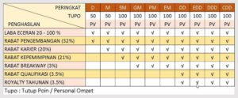
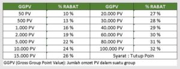

Berikut ini akan kami infokan macam-macam penghasilan Bisnis Nasa PT Natural Nusantara agar anda mempunyai sedikit gambaran langkah yang tepat dalam menjalani bisnis ini sehingga bisa mendapatkan penghasilan yang maksimal.

Tapi sebelum anda mempelajari ini, ada baiknya anda pelajari dulu tentang [Marketing Plan Nasa]({{ site.baseurl }}/marketing-plan) dan istilah-istilah yang sering dipakai serta [Jenjang Karir Bisnis Nasa]({{ site.baseurl }}/jenjang-karir) pada halaman lain di website ini.

### 7 Macam Penghasilan Bisnis Nasa

**1. Keuntungan Langsung**

Adalah pendapatan yang diperoleh seorang distributor dari selisih harga konsumen dengan harga distributor.

**2. Rabat Pengembangan**

Adalah Rabat seorang distributor yang diperoleh dari jumlah persentase omzet BV dikurangi dengan jumlah persentase omzet BV frontline beserta groupnya. Besarnya persentase Rabat Pengembangan ditentukan berdasarkan omzet PV bulanan sesuai dengan tabel Rabat Pengembangan sebagai berikut :

**3. Rabat Karir**

Adalah rabat yang merupakan sebuah penghargaan dari perusahaan sebesar 20 % dari BV Nasional untuk Distributor yang berhasil mencapai Jenjang Karir Manager s/d Crown Diamond Director.

**4. Rabat Kepemimpinan**

Adalah sebuah penghargaan dari perusahaan sebesar 21 % dari BV Nasional untuk Distributor yang berhasil mencapai Jenjang peringkat Silver Manager s/d Crown Diamond Director dengan syarat mempunyai Side volume minimal 1.000 PV.

**5. Rabat Break Away**

Sebuah penghargaan sebesar 3 % dari BV Nasional dari perusahaan untuk Distributor Nasa dengan minimal peringkat Gold Manager yang mempunyai kaki dengan omset 100.000 PV keatas.

**6. Rabat Qualifikasi**

Penghargaan sebesar 3,5 % dari BV Nasional yang diberikan oleh perusahaan kepada Distributor dengan minimal peringkat Diamond Director (DD). Untuk perhitungannya sama dengan Rabat Kepemimpinan.

**7. Royalty Tahunan**

Penghargaan sebesar 3,5 % dari BV Nasional yang diberikan oleh perusahaan kepada Distributor dengan minimal peringkat Diamond Director yang akan diberikan setahun sekali. Perhitungannya sama dengan Rabat Qualifikasi.

Itulah [7 Macam Penghasilan Bisnis Nasa]({{ site.baseurl }}/macam-penghasilan-bisnis-nasa)
yang bisa anda dapatkan dengan menjadi Mitra Distributor Produk PT Natural Nusantara.

Untuk pembahasan lebih lanjut mengenai cara menghitung rabat atau bonus penghasilan diatas, akan diinfokan pada halaman khusus untuk Anda Distributor yang tergabung dalam jaringan N-12345. Selamat bergabung, Tetap Semangat dan Pantang Menyerah, Go SUCCESS !
